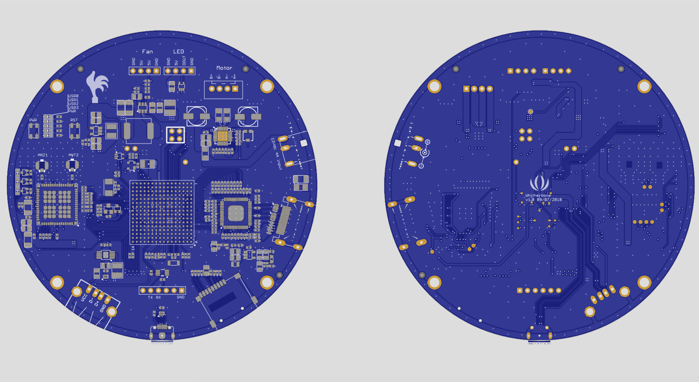

# whitherbone

Whithervanes: a neurotic, early worrying system are weathervanes controlled by the climate of fear on the Internet. They were first presented on five buildings in the seaside town of Folkestone, UK as part of the 2014 Folkestone Triennial. The Whithervanes parse newsfeeds looking for predetermined keywords related to fear (e.g. natural disaster, economic collapse, war, etc.) When fear is encountered the chickens respond by rotating away at increasing speeds from fear hot-spots and illuminating different colors triggered by specific levels of fear. Subsequently, 3 more full-size Whithervanes have been commissioned by Locust Projects in Miami for 2018.

We've been asked many times how people can have their own Whithervane. So, we are making the Whithervanes Open Hardware Kit. A prototype version was included in the “Are you talking to me?” exhibition currently in St. Etienne, France. We want to make the Whithervanes Open Hardware Kit a PocketBeagle derivative (Whitherbone), and need some help to do this.

http://www.whithervanes.com/
